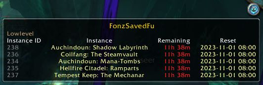
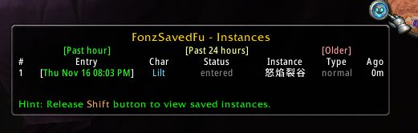
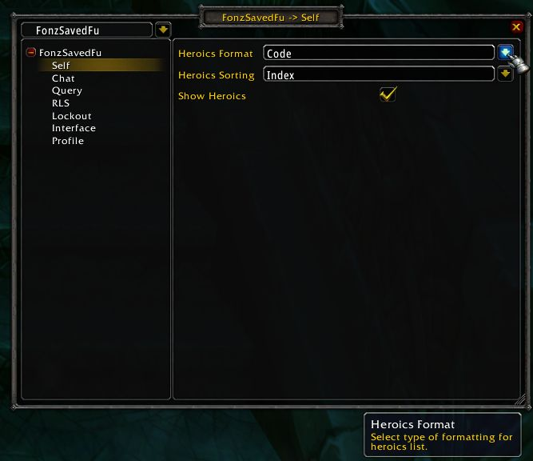

#  FonzSaved - World of Warcraft Addon

FonzSaved is an addon for World of Warcraft (TBC 2.4.3 client) to show saved 
instances and instance history. It can also query saved instances (raids) of 
other players, if they have the addon installed.

FonzSavedFu is an optional graphical frontend for FonzSaved with a minimap icon 
and FuBar support. FuBar is not required.

## Core Features

### General
* Shows saved instance information across an account for raids and heroic 
dungeons.
* Tracks and displays instance lockouts across an account (see [Notes](#notes)).
* Shows how long ago you entered an instance therefore when you can enter 
a new instance if you have hit the lockout limit. You can see this while logged
into any character on the account.
* Shows your instance history up to a customizable number limit. Entries are 
color-coded in the past hour, past 24 hours and after 24 hours.
* Tells your group, via chat and addon, when you as party or raid leader reset 
instances.
* Tells you if your party or raid leader resets an instance, if they have this 
addon.

### Raid Leader Saved (RLS)
* Announces when you as raid leader are saved to raids, when you create a new 
raid or when inviting others to the raid (with a cooldown for the announcement 
to prevent chat spam). It is disabled by default when inside an instance. 
Type `/rls` to toggle the feature temporarily or `/fsconfig rls enable` 
permanently.
* Automatically queries the saved raids of the raid leader when you join a raid 
group or when a party converts to a raid. This requires the raid leader to have 
installed this addon.

### Query
* Can query the saved instance (raid) information of others who have the addon
installed.
* Can query by name, target or mouseover with the `/saved` command, e.g. for a target `/saved t`.
* Can query by name and raid name when only interested in a specific raid, e.g.
`/saved Gigachad Sunwell`.

### Chat
* Can announce saved instance (raid) information to any chat channel, 
e.g. guild `/saved g`.

## Slash Commands

* **Saved instances**: `/saved` or `/fs`.
* **Instances (lockouts)**: `/instance`, `/lockout` or `/locked`.
* **Options**: `/fsconfig` or `/fsoptions`.

## User Interface

### FonzSavedFu - Saved Instances

### FonzSaved - `/saved`

### FonzSaved - `/saved ?`

### FonzSavedFu - Instance History 

Note. the strange date-time format and instance name language combination is for illustration only!

### FonzSavedFu - `/fsconfig` (or right click minimap icon)

## Notes

In WoW, entering a new instance counts towards an account limit within a 
period of time, usually five per hour before being unable to enter any 
new instances with the error "You have entered too many instances recently.". 
Instance resets allow new entries from previously entered unsaved instances 
within the period of time. Saved instances cannot be reset.

In this addon, each new entry into an instance that contributes to the instance
count limit is a called an 'instance lockout'.

## Known Issues
* On a standard server there is no way to know if a group leader resets normal
unsaved instances with the character portrait "Reset all instances" option or
via the `/run ResetInstances()` WoW command. If the group leader has this addon,
then the addon automatically applies the reset to your list of instances, so no
action is necessary. If the group leader does *not* have this addon, then you 
should us the `/lad` (aka. `/lockout add`) command to manually add the next 
instance you enter to the list. That instance will be shown as "added".
* On a standard server there is no way to confirm instance lockout information
before hitting the limit. This means it may be possible in some uncommon 
situations that fake additional lockouts are created by the addon. You can 
delete these lockouts with the `/lockout del #` command where `#` is the lockout 
index.
* FonzSavedFu uses popular shared libraries for convenient graphical support. 
This means it is possible, though unlikely, for it to conflict with some other 
addons and generate error messages.
FonzSaved, the underlying addon with chat commands, does not have this problem
since it shares no code with any other addon.
* The addons do their best to offer multi-language support. However, some
information, e.g. the saved instance strings from the `GetSavedInstanceInfo()`
WoW API are not documented anywhere and are part of the WoW client. If 
you play with a client that is not enUS or enGB, you can modify the locale files 
for translations, e.g. the correct names for saved heroic dungeons
especially. If you also send the translations back to the [original project](https://github.com/fondlez/FonzSaved), 
it can greatly improve the addon for everyone in future!

## Motivation and Credits

### Motivation

A raid leader and others are organizing a new raid. A member enters the 
raid zone itself and does not notice that they become saved to that raid 
instance. Later, perhaps when all members are inside the raid zone, someone 
notices they are saved and now everyone is stuck with this raid instance ID, or 
until significant time and effort is made to contact a server admin to remove 
the unexpected raid instance ID from all players who entered.

The original purpose - Raid Leader Saved (RLS) and Query modules - is 
to help prevent such a saved group forming as early as possible.

The original idea and implementation for this addon are by 
**[fondlez](https://github.com/fondlez)**.

### Credits
The parts of the addon for graphical display of saved instances and instance 
lockout tracking were inspired by:
* [SavedInstances](https://www.curseforge.com/wow/addons/saved_instances): the original TBC saved instance information addon.
* [Nova Instance Tracker](https://www.curseforge.com/wow/addons/nova-instance-tracker): the popular Retail/Classic instance tracker.